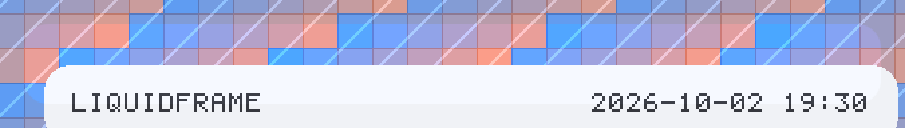
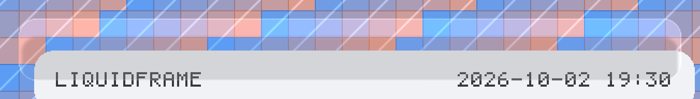
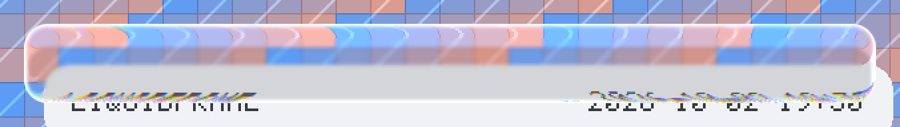
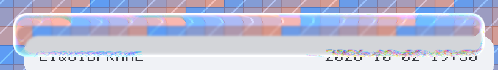

# LiquidFrame

[English](README.md) | [简体中文](README_CN.md)

[](https://www.android.com/)
[](https://github.com/LSPosed/LSPosed)
[](https://kotlinlang.org/)
[](LICENSE)
[](../../actions)

LSPosed 模块：将小米相机照片水印的背景替换为 Apple 风格**液态玻璃**材质，附带 HyperOS（miuix）应用用于设计与调校该材质

> 独立项目，与小米、徕卡、Apple 无任何关联、背书或支持

---

## 目录

- [功能](#功能)
- [截图](#截图)
- [仓库结构](#仓库结构)
- [环境要求](#环境要求)
- [安装](#安装)
- [配置](#配置)
- [材质](#材质)
  - [渲染方式](#渲染方式)
  - [为何需要伴生应用](#为何需要伴生应用)
- [Hook 原理](#hook-原理)
- [构建](#构建)
- [故障排查](#故障排查)
- [限制与已知问题](#限制与已知问题)
- [致谢与许可](#致谢与许可)

---

## 功能

小米相机为每张照片合成水印：带设备型号、日期、常带徕卡或品牌标识的背景面板。LiquidFrame 在合成完成后拦截位图，仅重建**背景面板**为折射玻璃表面——相机自己的文字、Logo 与元数据原样保留

这里的"液态玻璃"指不止于模糊的表面：

| 属性 | 贡献 |
| --- | --- |
| **折射（透镜）** | 背景采样偏移向轮廓方向递增，面板弯曲并放大其后场景，而非单纯雾化 |
| **色散** | 折射分裂为七采样光谱，沿对角线反对称——对边上呈棱镜效果，而非均匀色边 |
| **鲜活度** | 对捕获背景做饱和度提升。真实玻璃会聚拢色彩；缺失时材质在饱和内容旁读作灰色雾霭 |
| **镜面边缘** | 圆角边缘的半球法线，双向受光，产生随光线旋转的两个对向高光 |
| **内阴影** | 柔和的贴边阴影，使面板读作实体而非贴纸 |

模块在其逆向工程所针对的两个小米相机构建上工作；承诺范围见[限制](#限制与已知问题)

## 截图

伴生应用将材质渲染在刻意严苛的背景上——饱和色块、硬边、细颗粒——使透镜、色散与边缘高光对着有结构可弯曲的内容受检。下方水印按小米相机的产出方式合成（面板是相机绘制的预烘焙图片，其上叠放标签），材质由模块运行的同一套光学施加于该成品位图

| 基线（面板原样） | 磨砂（模糊 + 着色，无透镜） | 液态玻璃（加入透镜） |
| --- | --- | --- |
|  |  |  |

高色散特写——光谱分裂沿对角线反对称，对边上读作棱镜而非均匀色边：



> 这些是材质自身光学的渲染图，由 `docs/RenderSamples.kt` 在合成场景上离设备生成（不依赖 `./gradlew`，用独立 Kotlin 编译器运行——见 `docs/renders.txt`）。它们是实现的对照基准，非设备截图

## 仓库结构

```
app/                    LSPosed 模块（水印 Hook）
  src/main/java/com/mouya/LiquidFrame/
    WatermarkHooks.kt     Hook 安装与合成管线
    DexKitHelper.kt       驱动发现，等待宿主 Application
    ConfigStore.kt        模块与相机进程共享的设置
    GlassConfig.kt        相机侧的设置视图
    ConfigActivity.kt     设置 UI：Compose + 玻璃质感，实时预览
    dex/DexScanner.kt     无依赖 DEX 读取器，用于寻找 Hook 目标
    glass/                光学引擎（无 Android 依赖）
      LiquidGlassOptics.kt  材质的 CPU 移植
      GlassParams.kt        材质中的每个量
      PanelScan.kt          从像素定位水印面板
gallery/                HyperOS（miuix）应用：实时组件形态的材质
  src/main/java/com/mouya/LiquidFrame/gallery/
    GlassNavigationBar / LiquidBackdrop / GalleryApp
    glass/                实时（GPU）材质
      Lens.kt               AGSL 圆角矩形折射透镜
      Glass.kt              GlassSpec 与 Modifier.liquidGlass
    screens/              材质、控件与浮层页面
docs/                   参考渲染图
```

## 环境要求

**模块（`app/`）**

- Android 8.0+（API 26）。材质在 CPU 上对整数像素缓冲运行，无 `RuntimeShader` 门槛；设置 UI 出于同样理由使用 Jetpack Compose 与手绘玻璃表面
- 小米相机 `com.android.camera` 或 `com.miui.camera`
- LSPosed（或其他 Xposed API 82+ 兼容框架）
- Root 与可写的 `/data/local/tmp`——设置与日志存于此

**伴生应用（`gallery/`）**

- Android 13+（API 33）。`miuix-blur` 硬性要求此门槛
- 无需 Root 与 LSPosed，普通应用

## 安装

1. 构建或下载 `app-debug.apk` 并安装
2. 在 LSPosed 中启用模块，**作用域仅设小米相机**（`com.android.camera`）
3. 强停小米相机后重开
4. 开启水印拍照

确认运行：打开模块设置应用，日志显示最近一次拍摄的检测面板几何与材质参数值

## 配置

从桌面打开模块。设置写入 `/data/local/tmp/lf_config.txt`，设置应用与相机进程共读，变更即时作用于下一次拍摄，无需重启任何东西

设置页用与模块相同的光学渲染**实时预览**，无需拍照即可评判与调校材质。控件：

| 设置 | 效果 |
| --- | --- |
| 启用 | 总开关 |
| 折射带高度 | 沿轮廓的折射带厚度。过小读作发丝线；过大把整个面板扭曲成鱼眼 |
| 折射强度 | 轮廓处的峰值位移。有效范围约为折射带高度的 1–3 倍 |
| 背景模糊 | 捕获背景的磨砂。保持低值：重模糊会摧毁透镜本要弯曲的细节 |
| 内部提亮 | 面板全域的加性提亮。相机自身标签的可读性旋钮 |
| 着色 | 覆盖在折射背景上的着色强度 |
| 边缘高光 | 镜面边缘强度 |
| 内阴影 | 贴边阴影 |
| 高光方向 | 边缘光方向，单位为度 |
| 立体感 | 将表面法线向中心倾斜，使玻璃读作穹顶 |
| 色散 | 光谱分裂强度；`0` 为关闭 |
| 自适应明暗 | 按场景平均亮度缩放着色、罩纱与边缘 |
| 保留原有文字 | 相机自己的标签保留在材质之上 |

"恢复默认参数"还原出厂值；"复制诊断日志"将最近运行诊断放入剪贴板

## 材质

### 渲染方式

光学是 miuix 生态参考渲染器（[Kyant0/AndroidLiquidGlass](https://github.com/Kyant0/AndroidLiquidGlass)，Apache-2.0）的移植。同一套数学存在于两个后端，因其必须运行的两处约束不同：

- **`app/glass/LiquidGlassOptics.kt`**——整数像素缓冲上的 CPU 实现。小米相机在产出 JPEG 的过程中合成水印：没有硬件加速画布，也没有可采样的实时视图层级，材质施加于成品位图。此文件**无任何 Android 依赖**，这正是光学可离设备测试的原因
- **`gallery/glass/Lens.kt`**——AGSL `RuntimeShader`，经 miuix 背景引擎作为实时 `RenderEffect` 链应用。伴生应用的实时路径

两者保留参考自身的数学而非近似：

- 符号距离场及其梯度为参考的 `sdRoundedRect` / `gradSdRoundedRect`
- 位移剖面为 `circleMap(1 - -sd / refractionHeight)`——单位圆的矢高，而非线性斜坡——乘以负值使背景被向内拉动，面板放大其后内容
- 表面法线为 `normalize(gradSdRoundedRect(c, halfSize, min(1.5r, minHalf)) + depth * normalize(c))`；`1.5 ×` 系数来自参考自身：引入它的上游 commit 唯一目的就是匹配 Apple 的渲染
- 色散为参考的七采样光谱与精确通道除数（`1/3.5` 主导，纯红蓝 `1/3.0`，串扰 `1/7.0`）
- 效果顺序按文档：**颜色滤镜 → 模糊 → 透镜**

参考中以*绘制操作*表达的两项被解析建模，因为着色器没有描边或模糊掩码可依赖：

- **边缘高光**是参考的模糊白描边，结合其 `Default` 高光着色器的方向加权
- **内阴影**是其记录图层——形状填充、偏移形状清除、再模糊

默认比例按参考项目自身的 Apple 对比图校准：其中 300 px 玻璃使用 20 px 折射带与 60 px 位移

### 为何需要伴生应用

材质的实时形态无法注入小米相机。两个被逆向的相机构建均为**无 Compose 运行时的经典 View 应用**：对其 DEX 字符串表的扫描找不到任何 `androidx/compose` 引用（只有 `Lmiux/...` View 类）。向相机进程托管 Compose UI 意味着向其塞入整个 Compose 运行时

因此项目拆分：模块在 CPU 上对成品位图施加材质，伴生应用在 miuix 组件上实时承载——包括一个边缘高光可见地弯曲其后飘过内容的悬浮底栏

伴生应用基于 [`miuix`](https://github.com/compose-miuix-ui/miuix)（小米开源设计系统，Apache-2.0）。`miuix-blur` 提供背景引擎——graphics-layer 捕获、模糊级联、`runtimeShaderEffect` 扩展点——以及 `buildBloomStrokeShader`，正是此材质需要的镜面边缘模型。miuix 刻意留给应用的是**透镜**，即 `gallery/glass/` 所提供者

## Hook 原理

以下全部由反汇编目标 APK 确立。管线针对 `com.android.camera` `1+6.4.000250.2`（HyperOS 4 移植版，小米 10），并与 `6.4.000370.0`（小米 13）交叉验证：

```
LE5/b->h(...)                          相机侧 "processWatermark"：将 I420 帧
                                       提升为全尺寸照片 Bitmap
watermark/b->b(Application, Bitmap, Dc/b, I) -> Bitmap
watermark/b->c(b, Context, Bitmap, Dc/b, I, String, I) -> Bitmap
watermark/c->c(Context, Bitmap, Dc/b, I, Cc/a, String, Z,
               PorterDuff$Mode, String, o9/O) -> Bitmap
Fe/a->j(Fe/a, Bitmap src, ColorSpace, I, I, String, I) -> Bitmap     <-- 合成
```

`Fe/a->j` 创建**一个**输出位图，将照片 blit 进去，再按绘制顺序叠加水印元素树。两个后果决定设计：

1. 输出位图是**已合成水印的完整照片**，面板后的像素即场景本身。玻璃折射真实照片内容，模块无需另行获取照片位图
2. **无画布级缩放因子**。各风格 `config.json` 中的 dp 值在布局时一次性乘以 `min(photoW, photoH) / 1080`，此后每个元素已在绝对输出像素中

模块因此对成品合成做后处理。安装三个 Hook：

| Hook | 用途 |
| --- | --- |
| `pe.o-><init>(Bitmap)` | 每次渲染由 `Fe/a->j` 调用一次，传入所有内容绘制进的位图。捕获实时目标 |
| `pe.o->h(FFFF, Paint)` | 元素树的 `Canvas.drawRect`，即背景面板。全应用仅两个调用方，均为背景绘制；平面画布清除走单独的 `Canvas.drawColor`，不会到达这里 |
| `Fe/a->j` | 合成本身。其返回的位图被就地后处理 |

两个易错细节被显式处理：

- **传给 `pe.o->h` 的矩形是元素局部坐标——恒为 `(0, 0, w, h)`。** 绝对位置在父组的 `Canvas.translate` 调用中，矩形使用前须先经画布自身矩阵映射
- **背景面板是预渲染 WebP，而非绘制图元**（`assets/watermarks/<style>/<id>/icon_background_{light,dark}_blur.webp`）。圆角烘焙在 WebP 的 alpha 与该风格 `config.json` 的 `rect_params.rect_radius` 中，模块**测量**面板自身轮廓的圆角而非假设

因混淆名可能随相机构建变化，面板也可仅凭像素恢复：`PanelScan` 寻找**硬边水平均匀条带**——模糊背景 WebP 留下的形状——再以 `hasLabelDetail` 确认，其要求真实文字的暗色列成串出现。明亮天空条带满足第一测而败于第二测，普通场景块不会被误认。扫描在跨步采样网格上运行，成本是几千次读取而非全分辨率拷贝。未来构建若改名 Hook 类，模块仍能找到面板

Hook 目标在运行时由 **`app/src/main/java/com/mouya/LiquidFrame/dex/`** 发现——本仓库内的无依赖 DEX 读取器。解析相机自身 APK 的 dex 表恢复 Hook 所需结构——类名、超类、声明方法签名与声明字段类型——随后匹配两种形状：

- **画布包装器**：含 `<init>(Bitmap)`、`drawRect` 形状方法（`void`、四个 `float`、一个 `Paint`）与声明 `Canvas` 字段的类
- **合成**：静态方法，参数 `(Bitmap, ColorSpace, int, int, String, int)`，返回 `Bitmap`

这取代了早期对 [DexKit](https://github.com/LuckyPray/DexKit) 的尝试——后者无法被 AGP 9 的内置 Kotlin 支持消费，且曾把模块硬编码到 `Fe.a` 与 `pe.o`——仅存在于单一相机构建的名字。扫描在后台线程运行（读取整个 APK，绝不碰主线程），安装不阻塞于它：已知可用名字先 Hook，立即拍照依然有效；发现的名字在扫描落地后补挂。面板检测独立于这一切——见上文 `PanelScan`。完整逆向分析见 `hyperceiler-findings.md`

## 构建

要求：JDK 21 与装有 platform `android-37` 的 Android SDK

```bash
./gradlew assembleDebug
```

产物：

```
app/build/outputs/apk/debug/app-debug.apk          # LSPosed 模块
gallery/build/outputs/apk/debug/gallery-debug.apk  # 伴生应用
```

工具链：Android Gradle Plugin **9.4.1**、Kotlin **2.4.20**、Gradle **9.8.0**。`miuix 0.9.4 / Compose 1.12` 依赖链拒绝被更旧工具链消费（其 AAR 元数据直接拒绝），门槛因此在此。AGP 9 自带 Kotlin，故刻意不应用 `org.jetbrains.kotlin.android`；Compose 编译器经 `org.jetbrains.kotlin.plugin.compose` 单独应用

CI 仅构建 `:app`。`gallery/` 需要 `compileSdk 37`，故本地构建，不随每次推送

## 故障排查

**照片毫无变化。** 检查模块日志（打开其设置应用）。按概率排序：

- 模块未作用于 `com.android.camera`。LSPosed 作用域设置是最常见原因
- 启用模块后未强停小米相机
- 日志显示 `skip: no watermark panel found`。此构建的水印布局不在扫描器识别范围——请带日志与所用水印风格开 issue
- 所选水印风格使用不透明背景而非半透明。模块替换相机的背景面板；不绘制面板的风格无可替换

**面板发灰或失去纹理。** 材质被施加于以分类器未预期方式全不透明烘焙的面板。开 issue 时注明风格

**标签消失。** 打开"保留原有文字"。模块仅保留能识别为内容的标签，这要求面板背景足够平坦；摄影式面板没有可区分标签的平坦底色

**伴生应用无玻璃。** RuntimeShader 需要 API 33+。低于此版本按设计绘制无材质版本而非崩溃

## 限制与已知问题

- **Hook 目标运行时发现，非硬编码。** 一个小体积无依赖 DEX 读取器（`dex/DexScanner.kt`）解析相机 APK 自身的 dex 表并匹配两种结构形状：画布包装器（`<init>(Bitmap)`、`drawRect` 形状方法、声明 `Canvas` 字段）与合成（静态 `(Bitmap, ColorSpace, int, int, String, int) -> Bitmap`）。与 [HyperCeiler](https://github.com/ReChronoRain/HyperCeiler) 相机 Hook 的目标相同——其在 `UnlockLeica.kt` 中的自注是"跨一个大版本就需要改一下特征点"。若扫描无法运行或无结果，模块回退到被逆向构建的已知混淆名。完整分析见 `hyperceiler-findings.md`
- **尚未在实体设备上端到端验证。** 光学已通过渲染到图像并检查完成离设备验证；Hook 的运行时行为需在目标手机上以日志确认
- **伴生应用的默认材质值仅是起点。** 已按参考的 Apple 对比图校准，但正确值取决于宿主调色板与壁纸——请使用应用内调校器
- **伴生应用的浮层表面不是玻璃。** 对话框与底部弹层会调暗或遮挡背景，材质将无可折射。此为刻意设计，已在应用内说明
- **仅替换背景面板。** 相机的文字与 Logo 按设计保留；这不是水印编辑器
- **需要 Root 与 LSPosed。** 修改他人应用的位图无非 Root 路径

## 致谢与许可

- 液态玻璃光学改编自 [Kyant0/AndroidLiquidGlass](https://github.com/Kyant0/AndroidLiquidGlass)（Apache-2.0）。参考的着色器源码、常量与 `1.5 ×` 梯度系数按原样使用；CPU 移植与解析式边缘/内阴影模型属本项目
- 伴生应用基于 [compose-miuix-ui/miuix](https://github.com/compose-miuix-ui/miuix)（Apache-2.0），小米设计系统。其模糊引擎提供背景捕获与镜面边缘模型
- `gallery/glass/` 中的 `lens()` 与 `vibrancy()` 效果改编自 miuix 自带示例实现（`example/shared/.../component/liquid/`），同为 Apache-2.0

所有改编文件在头部注释保留上游署名

本项目以 Apache License 2.0 许可——见 [LICENSE](LICENSE)